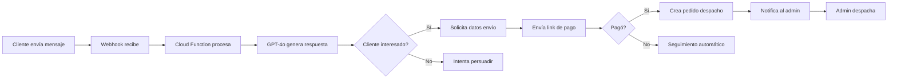

# NEXUS AUTO-SALES 🚀

Sistema de **Venta Autónoma Proactiva** potenciado por IA. Tu negocio vende solo mientras tú duermes.

## 🎯 Cómo Funciona

```
1. CARGA → Subes el producto con foto y precio
2. IA EN ACCIÓN → El agente publica y chatea con clientes
3. NOTIFICACIÓN → "Venta cerrada. Pago verificado. Dirección: Calle X"
4. DESPACHO → Imprimes la etiqueta y entregas el paquete
```

## 🏗️ Arquitectura

### Frontend (Next.js 14 + CSS Puro)
- **Dashboard**: Métricas en tiempo real
- **Conversaciones IA**: Monitor de chats automatizados
- **Despachos**: Gestión de envíos
- **Configuración IA**: Personalización del agente

### Backend (Firebase)
- **Firestore**: Base de datos en tiempo real
- **Cloud Functions**: Lógica del Agente IA
- **Storage**: Comprobantes de pago
- **Auth**: Autenticación segura

### IA (OpenAI GPT-4o)
- Respuestas naturales y persuasivas
- Cierre automático de ventas
- Recolección de datos de envío
- Verificación de pagos

## 📦 Estructura de Firestore

```
productos/
├── nombre, descripcion_ia
├── costo_compra, precio_retail
├── stock, link_pago_base
└── imagenes[]

conversaciones/
├── cliente_id, cliente_nombre, plataforma
├── producto_interes_id, estado
├── historial_chat[]
├── datos_envio{}
└── pago_confirmado

pedidos_despacho/
├── cliente_datos{}
├── producto_id, cantidad, total
├── ganancia_neta
├── tracking_number
└── estado

configuracion_ia/
├── nombre_tienda, tono_vendedor
├── prompt_sistema
├── mensajes_predefinidos
├── horario_atencion
└── openai_api_key
```

## 🛠️ Instalación

### 1. Clonar y Configurar

```bash
cd nexus-tech-admin
npm install
```

### 2. Variables de Entorno

Crea `.env.local`:

```env
# Firebase
NEXT_PUBLIC_FIREBASE_API_KEY=tu_api_key
NEXT_PUBLIC_FIREBASE_AUTH_DOMAIN=tu_proyecto.firebaseapp.com
NEXT_PUBLIC_FIREBASE_PROJECT_ID=tu_proyecto
NEXT_PUBLIC_FIREBASE_STORAGE_BUCKET=tu_proyecto.appspot.com
NEXT_PUBLIC_FIREBASE_MESSAGING_SENDER_ID=123456789
NEXT_PUBLIC_FIREBASE_APP_ID=1:123456789:web:abc123

# Firebase Admin (para Cloud Functions)
FIREBASE_SERVICE_ACCOUNT={"type":"service_account",...}
```

### 3. Desplegar Cloud Functions

```bash
cd functions
npm install
npm run build
firebase deploy --only functions
```

### 4. Ejecutar Localmente

```bash
npm run dev
```

## 🤖 Configuración del Agente IA

### 1. API Key de OpenAI

1. Ve a [platform.openai.com](https://platform.openai.com)
2. Crea una API Key
3. Agrégala en **Configuración IA** → OpenAI API Key

### 2. Personalizar el Prompt

En **Configuración IA**, ajusta:

- **Nombre de la Tienda**: Cómo se presenta el agente
- **Tono**: Profesional, Amigable o Persuasivo
- **Prompt del Sistema**: Instrucciones detalladas
- **Mensajes Predefinidos**: Bienvenida, sin stock, pago recibido

### 3. Integrar Webhooks

#### Facebook Messenger
1. Crea una App en [developers.facebook.com](https://developers.facebook.com)
2. Configura el Webhook: `https://us-central1-TU_PROYECTO.cloudfunctions.net/webhookFacebook`
3. Token de verificación: Configúralo en Firebase

#### WhatsApp Business
1. Usa la API de WhatsApp Business o servicios como Twilio
2. Configura el webhook para enviar mensajes a `procesarMensaje`

#### n8n / Make.com
Para automatizaciones más complejas:
1. Captura mensajes de cualquier plataforma
2. Envía POST a `procesarMensaje` con:
   ```json
   {
     "cliente_id": "unique_id",
     "cliente_nombre": "Nombre",
     "cliente_telefono": "+57...",
     "plataforma": "whatsapp",
     "producto_id": "optional",
     "mensaje": "Texto del cliente"
   }
   ```

## 🔔 Notificaciones

Cuando la IA cierra una venta, puedes recibir alertas por:

- **Email** (configura SendGrid en Cloud Functions)
- **WhatsApp** (configura Twilio)
- **Telegram** (agrega un bot)
- **Push** (usa Firebase Cloud Messaging)

## 📊 Flujo de Venta Automática



## 🎨 Diseño CSS Puro

El sistema usa CSS Variables para un diseño consistente:

```css
:root {
  --color-primary: #6366f1;
  --color-success: #22c55e;
  --color-bg-dark: #0f172a;
  --radius-xl: 1rem;
  --space-6: 1.5rem;
}
```

Sin Tailwind. Sin frameworks. 100% personalizable.

## 📱 Módulos Disponibles

| Módulo | Descripción |
|--------|-------------|
| **Dashboard** | Métricas en tiempo real |
| **Conversaciones IA** | Monitor de chats automatizados |
| **Despachos** | Cola de pedidos para enviar |
| **Productos** | Inventario con descripción IA |
| **Configuración IA** | Personalizar el agente |
| **Alertas Stock** | Productos bajo mínimo |
| **Reportes** | Análisis de ventas |

## 🔒 Seguridad

- Autenticación Firebase
- Firestore Rules (configura en Firebase Console)
- API Keys encriptadas
- HTTPS obligatorio

## 🚀 Despliegue Producción

### Vercel (Frontend)

```bash
npm run build
vercel --prod
```

### Firebase (Cloud Functions)

```bash
firebase deploy --only functions
```

## 📈 Próximas Mejoras

- [ ] Integración nativa con Meta Marketing API
- [ ] Catálogo sincronizado con Marketplace
- [ ] Generación automática de imágenes con DALL-E
- [ ] Dashboard analytics avanzado
- [ ] App móvil para notificaciones

---

**Desarrollado con 💜 por tu asistente de IA**

*Tu negocio nunca duerme. Tu IA tampoco.*
