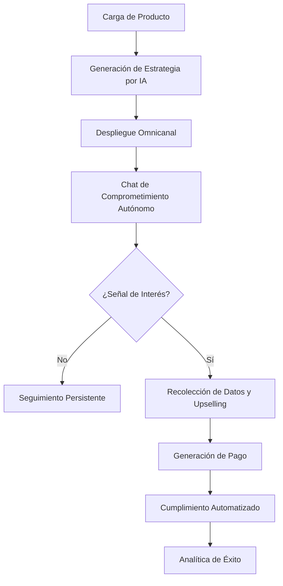

# NEXUS AUTO-SALES 🚀
## El Futuro del Comercio Autónomo Impulsado por IA

NEXUS AUTO-SALES es un sistema de **Ventas Autónomas Proactivas** de última generación, diseñado para gestionar todo el ciclo de vida de una venta —desde la captación inicial de clientes potenciales hasta la verificación de pagos y logística— sin intervención humana. Aprovechando el poder de los Modelos de Lenguaje de Gran Escala (LLM) y una arquitectura robusta en la nube, NEXUS permite que las empresas operen 24/7, convirtiendo conversaciones en ventas mientras tú te enfocas en crecer.

---

## 🌟 Visión e Impacto
En la economía digital acelerada de hoy, la velocidad y la personalización son claves para la conversión. NEXUS elimina la fricción de los procesos de venta manuales proporcionando:
- **Compromiso Instantáneo**: Respuestas sin latencia a las consultas de los clientes en múltiples plataformas.
- **Persuasión Basada en Datos**: IA que entiende la intención del cliente y utiliza disparadores psicológicos para cerrar ventas.
- **Automatización Sin Fisuras**: Desde el primer mensaje hasta la etiqueta de envío, todo el flujo está automatizado.
- **Información Accionable**: Un dashboard premium que ofrece visibilidad en tiempo real de tu fuerza de ventas autónoma.

---

## 🎯 Funcionalidad Principal: El Bucle Autónomo


```mermaid
graph TD
    A[Carga de Producto] --> B[Generación de Estrategia por IA]
    B --> C[Despliegue Omnicanal]
    C --> D[Chat de Comprometimiento Autónomo]
    D --> E{¿Señal de Interés?}
    E -->|No| F[Seguimiento Persistente]
    E -->|Sí| G[Recolección de Datos y Upselling]
    G --> H[Generación de Pago]
    H --> I[Cumplimiento Automatizado]
    I --> J[Analítica de Éxito]
```

1.  **ESTRATEGIZAR**: Sube un producto; nuestra IA genera guiones de venta optimizados y descripciones de marketing.
2.  **CONECTAR**: El agente chatea proactivamente con los clientes en WhatsApp, Messenger y más.
3.  **CERRAR**: El sistema maneja objeciones, verifica pagos y recolecta datos de envío.
4.  **ENTREGAR**: Se sincroniza con proveedores logísticos para preparar los envíos instantáneamente.

---

## 🏗️ Arquitectura Técnica

### 💻 Frontend: Next.js 14+ / 15
*   **Espacio de Trabajo Moderno**: Un panel de control de alto rendimiento construido con React 19 y Next.js.
*   **Monitoreo en Tiempo Real**: Feed en vivo de las conversaciones de IA activas y métricas de ventas.
*   **Diseño CSS Puro**: Optimizado para la velocidad y personalización total de marca sin el peso de frameworks pesados.
*   **Analítica Avanzada**: Gráficos interactivos potenciados por `recharts`.

### ⚙️ Backend: Ecosistema Firebase
*   **Firestore**: Base de datos de documentos en tiempo real para la gestión de estados de alta concurrencia.
*   **Cloud Functions**: El "Cerebro" del sistema, gestionando webhooks, lógica de IA e integraciones externas.
*   **Autenticación**: Seguridad de grado industrial para acceso administrativo y de socios.
*   **Almacenamiento (Storage)**: Manejo seguro de comprobantes de pago y activos de productos.

### 🧠 Capa de Inteligencia: OpenAI GPT-4o & Google Gemini
*   **Soporte Multimodelo**: Redundancia y lógica especializada utilizando los mejores LLM del mercado.
*   **Prompteado Dinámico**: Instrucciones sensibles al contexto que se adaptan a los tonos específicos de la tienda y los productos.
*   **Verificación Automatizada**: Verificación impulsada por IA de capturas de pantalla de transferencias bancarias y comprobantes de pago.

---

## 📂 Módulos del Sistema

| Icono | Módulo | Descripción |
| :--- | :--- | :--- |
| 📊 | **Dashboard** | Control de misión con ROI en tiempo real, volumen de ventas y seguimiento de leads. |
| 💬 | **Monitor de IA** | Supervisa e interviene (si es necesario) en conversaciones autónomas en vivo. |
| 📦 | **Gestor de Inventario** | Gestiona productos con asistencia de IA para descripciones y generación visual. |
| 🚛 | **Hub de Logística** | Rastrea envíos, gestiona etiquetas e intégrate con transportistas locales. |
| ⚙ | **Configurador de IA** | Ajusta la personalidad, el tono y las instrucciones del sistema de tu IA. |
| 📈 | **IA de Marketing** | (Próximamente) Automatiza campañas publicitarias y publicaciones en redes sociales. |

---

## 🛠️ Configuración e Instalación

### 1. Configuración del Entorno
Asegúrate de tener las siguientes claves listas en tu `.env.local`:

```env
# Configuración de Firebase
NEXT_PUBLIC_FIREBASE_API_KEY=tu_api_key
NEXT_PUBLIC_FIREBASE_AUTH_DOMAIN=tu_proyecto.firebaseapp.com
NEXT_PUBLIC_FIREBASE_PROJECT_ID=tu_proyecto
NEXT_PUBLIC_FIREBASE_STORAGE_BUCKET=tu_proyecto.appspot.com

# Claves de Proveedores de IA
OPENAI_API_KEY=sk-...
GOOGLE_GENERATIVE_AI_API_KEY=...
```

### 2. Flujo de Trabajo de Desarrollo
```bash
# Clonar el repositorio
git clone https://github.com/tu-usuario/nexus-tech-admin.git

# Instalar dependencias
npm install

# Iniciar el servidor de desarrollo
npm run dev
```

### 3. Desplegando el Backend
```bash
cd functions
npm install
npm run build
firebase deploy --only functions
```

---

## 🔒 Seguridad y Fiabilidad
- **Control de Acceso Basado en Roles (RBAC)**: Permisos detallados para administradores y operadores.
- **Comunicación Encriptada**: Todos los datos en tránsito y en reposo están asegurados vía la infraestructura de Google Cloud.
- **Lógica de Failover**: Mecanismos de reintento automatizados para webhooks y procesamiento de pagos.

---

## 📈 Hoja de Ruta (Roadmap)
- [x] **v1.0**: Bucle Central de Ventas Autónomas.
- [ ] **v1.5**: Integración nativa con WhatsApp Cloud API.
- [ ] **v2.0**: Visuales de productos integrados con DALL-E 3.
- [ ] **v2.5**: Sincronización automatizada con Marketplaces (FB Marketplace, Mercado Libre).
- [ ] **v3.0**: Demanda predictiva y reabastecimiento automático de stock.

---

**Desarrollado con 💜 por Antigravity AI**
*Transformando el comercio a través de la inteligencia autónoma.*
